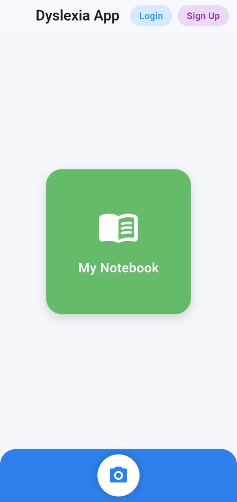
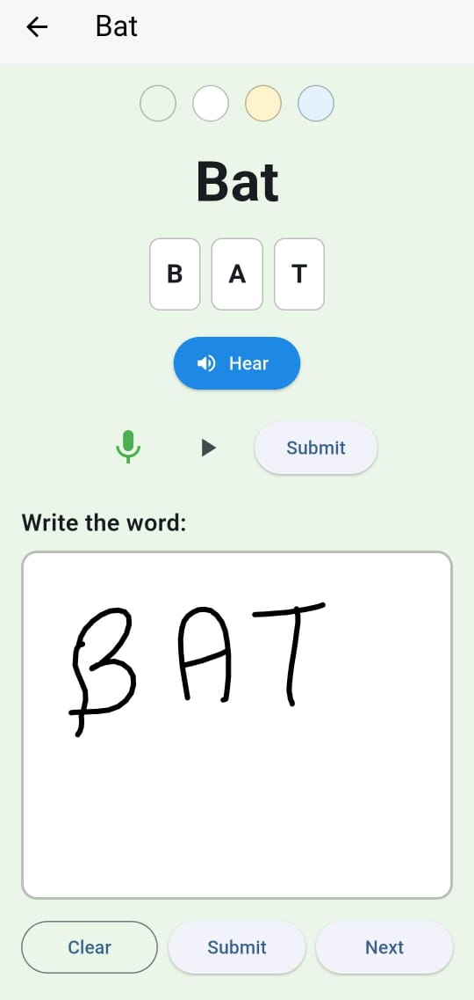
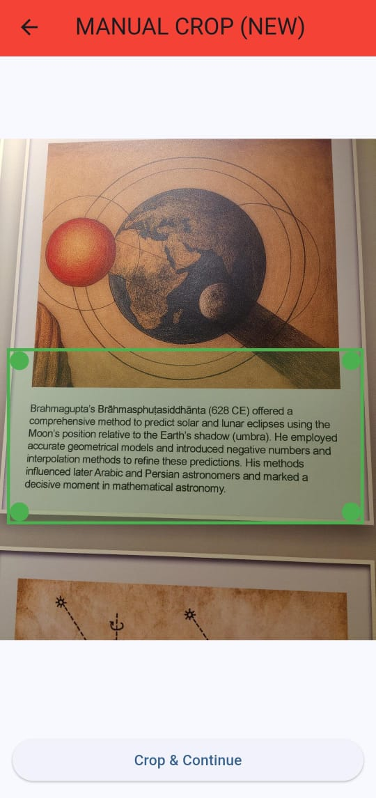
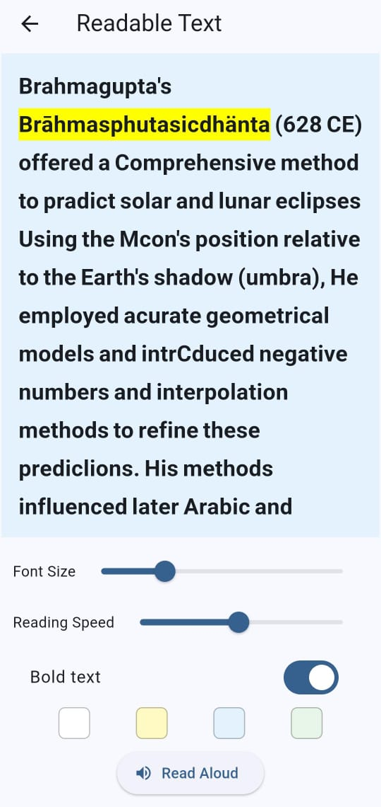

🧠 Dyslexia Learning Assistant

A multisensory, AI-assisted learning app for dyslexic learners

🚨 Problem Statement

Dyslexia affects nearly 1 in 10 people globally, making reading, writing, and phonetic recognition challenging—yet most learning tools remain text-heavy, non-adaptive, and inaccessible.

💡 Solution Overview

Dyslexia Learning Assistant is a mobile-first application designed to help dyslexic learners improve reading and writing through multisensory learning, AI-powered assistance, and adaptive practice.

The app combines:

Visual (writing & scanning)

Auditory (text-to-speech)

Interactive practice (levels & words)

to create a personalized and accessible learning experience.

✨ Key Features
📘 Learning Module (Notebook)

Level-wise word practice based on phonics rules

Letter-by-letter word breakdown

Writing practice using digital canvas

Text-to-Speech (hear the word aloud)

Progress tracking per word

🎙️ Speech Interaction

Speak words aloud for pronunciation practice

Speech submission to complete word learning cycle

📸 Scan & Convert

Capture or upload handwritten/printed text

Manual image crop for accuracy

OCR-based text extraction

Dyslexia-friendly readable output

Read-aloud support for extracted text

Adjustable font size for comfort

🧠 Adaptive Learning (Planned)

Test section per level

Dynamic difficulty based on user performance

AI-generated practice words for weak areas

## 📱 App Screenshots

### Dashboard

### Learning Module – Word Practice

### Scan & Convert (Manual Crop for Accuracy)

### Handwriting Practice

🛠️ Tech Stack

Flutter – Cross-platform mobile development

Google ML Kit

Text Recognition (OCR)

Digital Ink Recognition

Text-to-Speech (TTS) – Auditory reinforcement

Canvas-based Writing Recognition

Modular Service Architecture

🧩 Architecture Overview

The system follows a modular architecture separating:

UI Layer (Flutter widgets)

Service Layer (TTS, OCR, Progress Tracking)

ML Layer (Google ML Kit)

Local state management for progress

(See architecture diagram in presentation/demo)

🎥 Demo Video

📺 3-minute demo walkthrough showcasing:

Learning module

Writing & speech interaction

Scan & convert workflow

Accessibility features

🔗 Demo Video Link:
👉 (https://drive.google.com/file/d/1o01FiEHMrGxfybkNVCB7XKaTGSrG8o1U/view?usp=sharing)

📊 Why This Is Different

Designed specifically for dyslexic users

Multisensory approach (visual + auditory + motor)

Manual crop improves OCR accuracy

Adaptive learning planned using AI

Accessibility-first UI decisions

🔮 Future Enhancements

AI-generated word datasets per phonics rule

User performance analytics

Cloud-based profiles & sync

Parent/teacher dashboard

Multilingual dyslexia support

📚 References

International Dyslexia Association
https://dyslexiaida.org

Shaywitz, S. (2003). Overcoming Dyslexia

Snowling & Hulme (2012). Annual Review of Psychology

NIH & CDC Dyslexia Statistics
